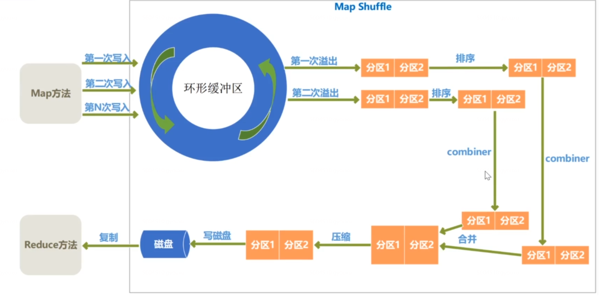
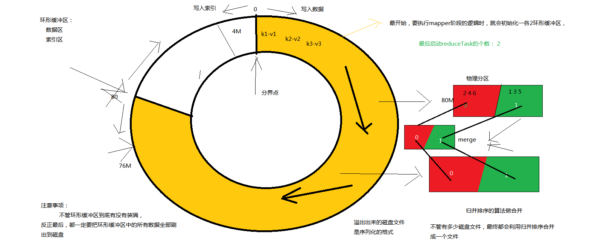
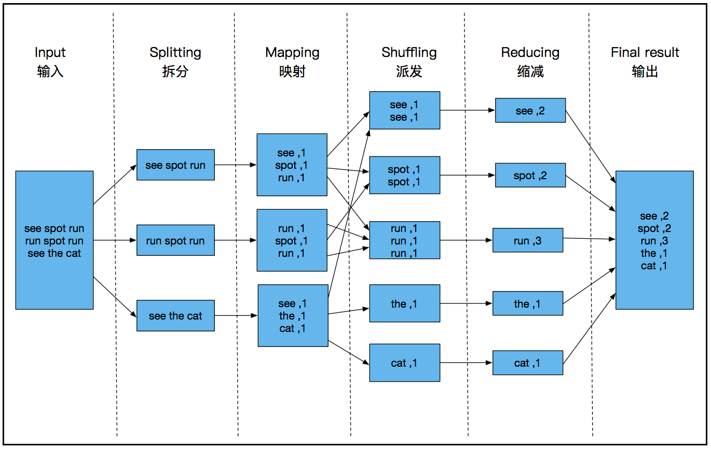

### Shuffle详解

	Shuffle：
		Mapper阶段输出数据到Reducer阶段接收数据的中间的这个数据分发的过程。
	
	Map Shuffle
		进去Mapper阶段的数据，要做分区，做完了分区之后，每个ReduceTask只需要到对应的分区编号上面去找对应的数据就可以了。
		ReduceTask从MapTask节点拉取多份结果数据的时候要做合并。
		
		环形缓冲区： 内存当中的一种首尾相接的数据结构；也可以叫做内存区域
		
		一个MapTask任务会初始化一个环形缓冲区
		
		一个MapTask输出的数据不一定小于100m，当环形缓冲区装不下的时候，怎么处理？
		
		溢出：
			溢出就是给内存当中的数据持久化到磁盘当中去
			1、溢出之前，就已经给所有的数据进行了分区操作。
			2、分区之前会对每个分区里面的数据进行排序,快速排序
			3、如果你设置了Combiner，那么会调用Combiner进行局部合并
			
		在溢出的时候，Mapper线程还要不要继续往环形缓冲区里面写数据？
			1、如果每次给环形缓冲区装满的话，肯定就不能写入新的数据了。
			2、如果每次不装满环形缓冲区就开始溢出数据，那么剩余空白的内存就可以接收新的key value的写入
			
		一个MapTask任务会初始化一个环形缓冲区	
		
		环形缓冲区：1、数据区 2、索引区
		
		非常重要的一点：不管环形缓冲区有没有装满，最后都一定要给环形缓冲区中所有的数据刷新到磁盘中。
		
		溢出的磁盘上的文件的合并采用了一种算法：归并算法

### YARN详解 

	概念：
	1、资源调度系统
	2、分布式的操作系统
	
	每次启动一个MR程序的时候启动一个主控程序：MRAppMaster
	
	任务的划分 + 任务的监控 + 任务的申请
	
	资源：CPU（核、线程）、内存、带宽、磁盘

​	
	Hadoop1.x和Hadoop2.x的版本介绍
	1、hadoop2.x版本以后，帮原来的MapReduce集群，分成了MapReduce编程API+YARN集群
		MapReduce集群架构：主从架构  
			主节点：JobTracker  从节点：TaskTracker
			
		YARN集群：主从架构
			主节点：ResourceManager  从节点：NodeManager
			
		仅仅是给原来的MapReduce集群当中的关于资源调度的代码，抽象出来形成了一个单独的组件，这个组件就叫做YARN
	
		为什么要形成单独的组件？原因是：
		1、各个组件各司其职
		2、让YARN集群运行除了MR之外的其他的分布式的计算程序
		
		总结：独立完成之后，分布式的程序可以运行在其他的资源调度系统上，同样的这个独立出来的资源调度系统也可以运行除了MR之外的其他的分布式计算程序。

​		
	2、Hadoop2.x以后给HDFS和YARN提供了高可用

​			
	3、Hadoop3.x
		先看Hadoop2.x当中还有什么问题：
		（1）Common没什么问题
		（2）HDFS当中采用冗余备份来保证数据的安全，需要消耗大量的磁盘。
					3.x新特性：纠删码
				冗余存储：消耗磁盘，但是节省CPU
				纠删码：消耗磁盘少，但是要找回数据，要经过大量计算
		（3）MapReduce：计算效率慢

	YARN集群可以理解成管理系统的系统
	
	HDFS集群就是管理所有真实文件系统的一个抽象的文件系统
		namenode.name.dir:配置多目录
		datanode.data.dir：也可以配置多个
	
	YARN给分布式程序提供一些容器做运算

	2.x的YARN集群相对于1.x的变化：
		2.x中YARN帮MRAppMaster分散的启动在各个NodeManage节点中
		
	ResourceManager 两大职责：
		1、管理NodeManager
		2、响应各种分布式计算任务的主控程序的启动
	
	调度器的算法：
		1、FIFO
		2、Fair Scheduler
		3、Capacity Scheduler