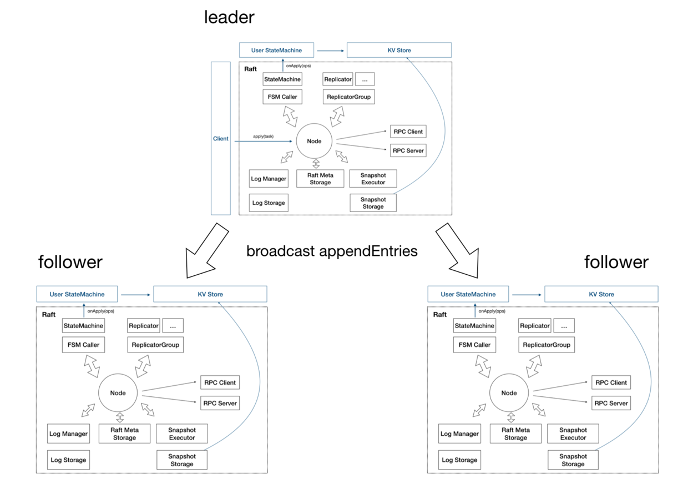
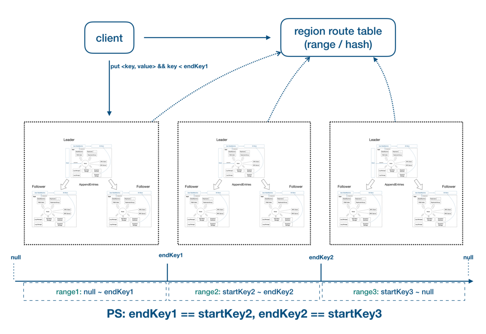
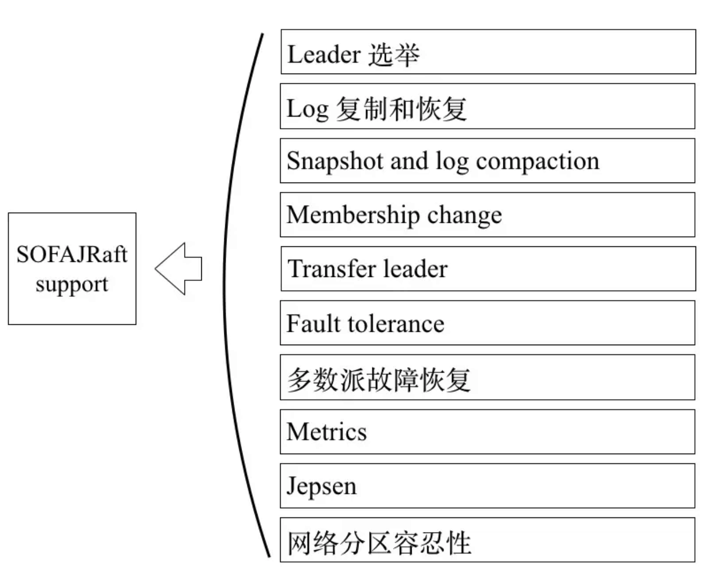

- SOFA-RAFT：https://juejin.im/post/5ca30faae51d451f3845c91f
- raft协议：https://www.yuque.com/huarou/gd4szw/hpaage
### 基本概念
Raft 最大的好处就是可以实现自身 leader 选举。如果一个分布系统要自我协调，通常是采用“投票”的方式，在“投票”的时候，为了解决冲突问题，就采用了两个机制：Term 和 Quorum。
- Term，即给每一次投票编号，以 1、2、3 这样的数字命名。
- Quorum，即少数服从多数原则，每一次投票必须要得到多数派（N/2 + 1）的同意才认为是成功
>Raft 是一种更易于理解的分布式共识算法，核心协议本质上还是师承 Paxos 的精髓，不同的是依靠 Raft 模块化的拆分以及更加简化的设计，Raft 协议相对更容易实现。
模块化的拆分主要体现在：Raft 把一致性协议划分为 Leader 选举、MemberShip 变更、日志复制、Snapshot 等几个几乎完全解耦的模块。
更加简化的设计则体现在：Raft 不允许类似 Paxos 中的乱序提交、简化系统中的角色状态（只有 Leader、Follower、Candidate 三种角色）、限制仅 Leader 可写入、使用随机化的超时时间来设计 Leader Election 等等。

### 架构设计

- Node：Raft 分组中的一个节点，连接封装底层的所有服务，用户看到的主要服务接口，特别是 apply(task)用于向 raft group 组成的复制状态机集群提交新任务应用到业务状态机。
存储：上图靠下的部分均为存储相关。

- Log 存储，记录 Raft 用户提交任务的日志，将日志从 Leader 复制到其他节点上。
LogStorage 是存储实现，默认实现基于 RocksDB 存储，你也可以很容易扩展自己的日志存储实现；
LogManager 负责对底层存储的调用，对调用做缓存、批量提交、必要的检查和优化。
Metadata 存储，元信息存储，记录 Raft 实现的内部状态，比如当前 term、投票给哪个节点等信息。
Snapshot 存储，用于存放用户的状态机 snapshot 及元信息，可选：

- SnapshotStorage 用于 snapshot 存储实现；
SnapshotExecutor 用于 snapshot 实际存储、远程安装、复制的管理。
状态机

- StateMachine：用户核心逻辑的实现，核心是 onApply(Iterator) 方法, 应用通过 Node#apply(task) 提交的日志到业务状态机；
FSMCaller:封装对业务 StateMachine 的状态转换的调用以及日志的写入等,一个有限状态机的实现,做必要的检查、请求合并提交和并发处理等。
复制

- Replicator：用于 Leader 向 Followers 复制日志，也就是 Raft 中的 AppendEntries 调用，包括心跳存活检查等；
- ReplicatorGroup：用于单个 Raft group 管理所有的 replicator，必要的权限检查和派发。
- RPC：RPC 模块用于节点之间的网络通讯

- RPC Server：内置于 Node 内的 RPC 服务器，接收其他节点或者客户端发过来的请求，转交给对应服务处理；
- RPC Client：用于向其他节点发起请求，例如投票、复制日志、心跳等。
- KV Store：KV Store 是各种 Raft 实现的一个典型应用场景，SOFAJRaft 中包含了一个嵌入式的分布式 KV 存储实现（SOFAJRaft-RheaKV）。

### 特点：Strong Leader
- 系统中必须存在且同一时刻只能有一个 Leader，只有 Leader 可以接受 Clients 发过来的请求；
- Leader 负责主动与所有 Followers 通信，负责将“提案”发送给所有 Followers，同时收集多数派的 Followers 应答；
- Leader 还需向所有 Followers 主动发送心跳维持领导地位(保持存在感)。

### Log 复制
下面我们就详细说一下 Log 复制。我们之前已经说了 Log 就是 Client 发送给复制状态机的一系列命令。这里我们再举例解释一下 Log，比如我们的复制状态机要实现的是一个银行账户系统，那么这个 Log 就可以是 Client 发给账户系统的一条存钱的命令，比如“存 100 元钱”。
Leader 与 Follower 之间的日志复制是共识算法运用于复制状态机的重要目的，在 Raft 算法中 Log 由 ```TermId```、```LogIndex```、```LogValue``` 这三要素构成

- Meta Storage 是用来存储记录 Raft 实现的内部状态，比如当前 Term 、投票给哪个节点等信息。

### Snapshot 
是快照，所谓快照就是对数据当前值的一个记录，Leader 生成快照有这么几个作用：
1. 当有新的 Node 加入集群的时候，不用只靠日志复制、回放去和 Leader 保持数据一致，而是通过安装 Leader 的快照来跳过早期大量日志的回放；
2. Leader 用快照替代 Log 复制可以减少网络上的数据量；
3. 用快照替代早期的 Log 可以节省存储空间。

### 单个 Raft group 是无法解决大流量的读写瓶颈的，SOFAJRaft 自然也要支持 multi-raft-group。
我们会因为各种各样的需求而去构建一个 Raft 集群，如果你的目标是实现一个存储系统的话，那单个 Raft 集群可能没有办法承载你所有的存储需求；如果你的目标是实现一个为用户请求提供 Service 的系统的话，因为 Raft 集群内只有 Leader 提供读写服务，所以读写也会形成单点的瓶颈。因此为了支持水平扩展，SOFAJRaft 提供了 Multi-Group 部署模式。如图所示，我们可以按某种 Key 进行分片部署，比如用户 ID，我们让 Group 1 对 [0, 10000) 的 ID 提供服务，让 Group 2 对 [10000, 20000) 的 ID 提供服务，以此类推。

### SOFT-raft提供功能特性


# 优先 Leader

## 目标

优先选举某个节点为 Leader，以控制负载。 假设某个组中包含 A B C 三个节点，指定 A 为优先节点，则期望以下自动行为：

1. 如果 A 节点在线，且与其它节点的日志高度差别不大时，优先选举 A 为 Leader
2. 如果 A 节点掉线后又上线，且日志高度追到与当前 Leader 较为接近时，当前 Leader 节点要尝试让出 Leader 角色给 A 节点

## 方案

优先Leader的整体方案依赖抢主（Take Leadership）和主转让(Leadership Transfer)两个子操作。

### 抢主 Take Leadership

Take Leadership 是指当前节点在想要主动成为Leader角色时，执行的抢主操作。

1. 如果当前节点是Follower, 将term+1，转为Candidate，进入抢主状态。如果已经是Candidate，也将term+1，进入抢主状态，具备如下特性：
2. 在日志高度一样时，不会为同一个term的其他Candidate投票
3. 将会以更小的重试间隔（voteInterval）进行选主。
4. 状态只维持一个term的选举。
5. 其他操作同普通的选主过程

抢主操作并不保证改节点一定能成为主。

### 主转让 Leadership Transfer

指定节点转让 Leader 角色是优先 Leader 的一个依赖功能，同时也可以作为独立的功能存在，实现手动的负载均衡。下面是描述其实现方案：

1. 首先 Leader 节点（假设为A节点）提供接口，接收将当前的Leadership 转让给 B 节点。
2. A 节点收到转让命令之后，为了避免过长时间的不可用，先检查B节点的落后的数据量 是否小于 配置的阈值（maxLeadershipTransferWaitIndex)，超了则返回转换失败，结束任务。
3. 如果B节点进度落后不多，则标记 A 节点状态为 "切换"，拒绝接收新的数据写入。
4. A 节点检查B节点的日志数据是否已经是最新，如果还缺数据，则 A 节点继续往 B 节点推送数据。
5. 当 B 节点的数据同步完成之后，A 节点往 B 节点发送命令，让其进行 Take Leadership 操作，争抢主节点。

### Preferred Leader

在 Preferred 节点上，选举的过程类似“抢主”的逻辑，但是不提升Term，避免打断集群。只有收到明确的“抢主”命令时才提升Term。 在 Leader 上，轮询检查，优先节点是否为主，如果不是主并且该节点健康，就发起 Leadership Transfer 操作, 尝试将主节点转让给该优先节点。


### index

### begin index

### end index

 ### term

### vote

