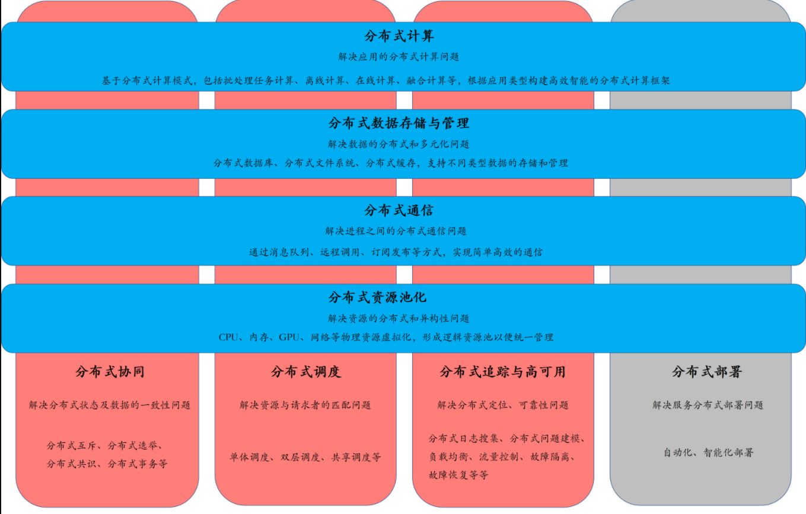

---https://kaiwu.lagou.com/course/courseInfo.htm?courseId=605#/detail/pc?id=6297

分部署数据库核心

1. 数据分片

   - 水平分片：按行进行数据分割，数据被切割为一个个数据组，分散到不同节点上。

   - 垂直分片：按列进行数据切割，一个数据表的模式（Schema）被切割为多个小的模式。

2. 数据同步

