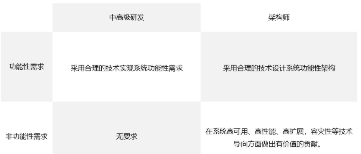
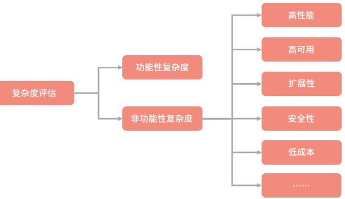

> 课程：https://kaiwu.lagou.com/course/courseInfo.htm?courseId=592#/detail/pc?id=6051

### 对系统架构设计的认知

- 落地没有实际经验，拔高没有理论支撑。
- 为什么做架构拆分 
  - 为什么做架构拆分？通常最直接目的就是做系统之间解耦、子系统之间解耦，或模块之间的解耦。
  - 为什么要做系统解耦？系统解耦后，使得原本错综复杂的调用逻辑能有序地分布到各个独立的系统中，从而使得拆封后的各个系统职责更单一，功能更为内聚。
  - 为什么要做职责单一？因为职责单一的系统功能逻辑的迭代速度会更快，会提高研发团队响应业务需求的速度，也就是提高了团队的开发效率。
  - 为什么要关注开发效率？研发迭代效率的提升是任何一家公司在业务发展期间都最为关注的问题，所以从某种程度上看，架构拆分是系统提效最直接的手段。

### 提高分析系统问题的认知

##### 因为对于系统技术架构升级的问题，业务方、管理者和技术人员的关注点是不同的。

- 业务方的诉求是在技术升级后，系统有能力迭代功能来满足市场的要求，所以关注点在系统能力。

- 管理者的诉求是在技术升级后，系统研发团队的开发效能得到提升，所以关注点在人效管理。

- 作为技术人员的你，需要找到自己做系统设计的立足点，来满足不同人对技术的诉求，而这个立足点通常就是系统设计原则。

  

**系统的设计原则不是乱提出来的，而是针对系统现阶段业务发展带来的主要矛盾提出，才会更有价值且被认可。** 

架构最重要的是要解决本质复杂性，这包括人的**复杂性和业务的复杂性**。

**中高级研发工程师与架构师标准**

### 能力边界认知

##### 研发工程师和架构师能驾驭的边界可以如下概括：

一个中高级研发工程师对系统的驾驭边界至少是模块或者子系统层面；

一个架构师对系统的驾驭边界至少是全系统层面；

一个高级架构师对系统的驾驭边界至少是某一领域层面。

---

产品业务发展快速、系统越来越多、协作效率越来越低。

----> 分析问题-》提出对应的解决方案-》针对不同的解决方案的优缺点汇总-》

### 分析系统架构的角度

- 在回答系统复杂度来源的时候，要注意结合具体的业务场景和业务发展阶段来阐述。业务场景表明了业务的独特性，发展阶段表明了业务的成熟度，因为同一业务场景在不同阶段产生的矛盾也是不同的。

- 在回答解决方案的时候，有价值的解决方案一定是建立在明确复杂度来源基础之上的。所以在设计架构的时候才分主要问题和次要问题，主要问题是必须要解决的点，次要问题可以根据实际情况进行取舍。

- 在回答如何评估架构方案时，至少要从功能性和非功能性两个角度出发判断方案的合理性。对于很难决策的方案，要从更高的视角（比如技术负责人、业务负责人的角度）进行考量。

- 在技术实现的细节上，要尽量讲出技术的实现原理，不要浮于表面的框架组合。