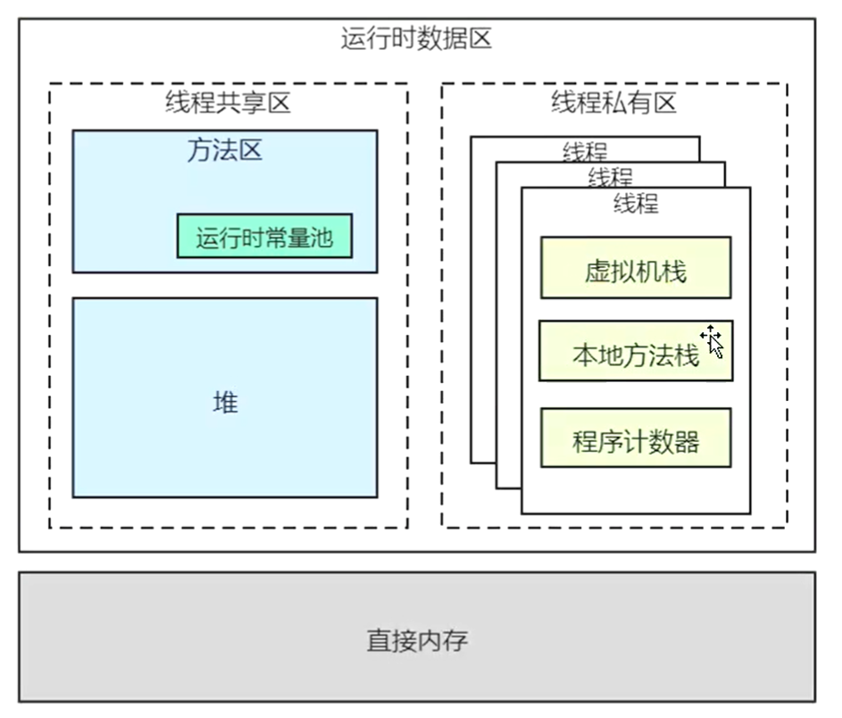
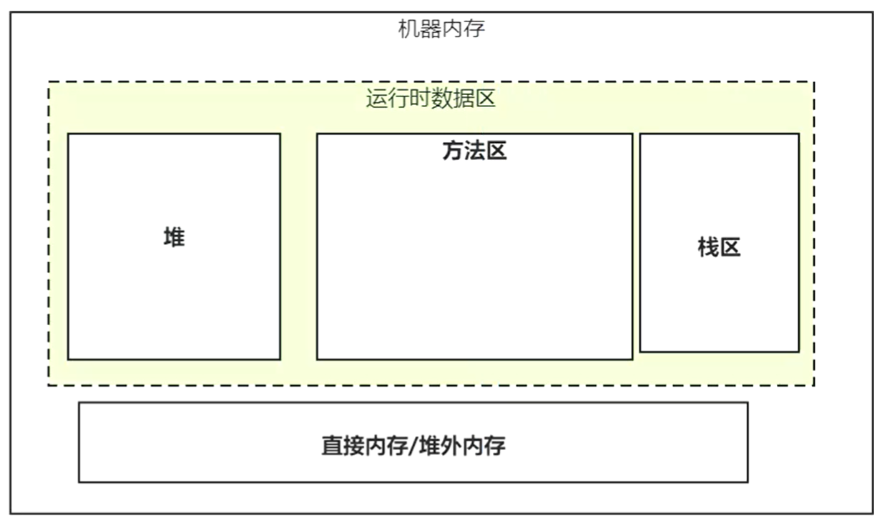

- Xss  栈大小设置参数，linux默认为1M

- 

#### 栈帧

- 局部变量表

- 操作数栈，是执行引擎的一个工作区

- 动态链接

- 完成出口

### 程序计数器

- 为什么需要有程序计数器，
  
  - 操作系统层面：CPU时间片轮转机制，模拟操作系统操作

### 本地方法栈

- native关键字的方法

- 虚拟机规范

### 方法区

- 逻辑划分，1.7 永久代；2.8 元空间

- class文件解析，

- 常量池
  
  - 运行时常量池
    
    - class-- 符号引用---->到直接引用（内存地址）
  
  - 静态常量池

### 堆

- 直接内存，NIO中DirectByateBuffer，

- echcache, 消息中间件，操作直接内存

- jhsdb

